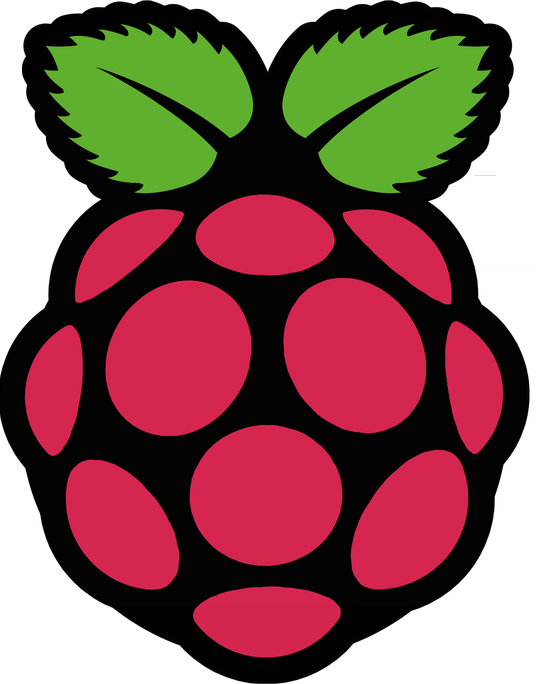

<h1 align="center">Hi 👋, I'm Eric</h1>
<h3 align="center">A passionate developer from Germany</h3>

  

- 🔭 I’m currently working on **Computer Vision in 3D**

- 🌱 I’m currently learning **Deep Reinforcement Learning**

- 💬 Ask me about **my projects**

<h3 align="left">Connect with me:</h3>

<h3 align="left">Languages and Tools:</h3>

 

 
---

---

---
 

---

 

---

 
---

 

---

---

---

